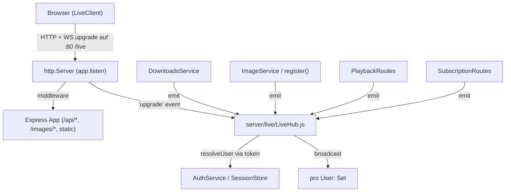

# WEBSOCKET — Konzept: Live-Events über `/live` auf dem gleichen Server-Port

> Nach erfolgreichem Login hält der Client eine WebSocket-Verbindung auf dem Endpunkt
> **`/live`** offen. Der WebSocket-Launcher läuft **auf demselben HTTP-Server und Port**
> wie Express (kein eigener WS-Port). Über diese Verbindung signalisiert der Server
> ereignisgesteuert, wenn Downloads, Bilder/Thumbnails oder andere zustandsändernde
> Vorgänge fertig sind — und ermöglicht so echte Cross-Device-Synchronisation, ohne
> dass der Client pollen muss.

---

## 1. Ziel und Problemstellung

### Ist-Zustand
- Der Client (`public/js/*`) ist rein **HTTP-pollend/auslösend**: Aktionen wie
  Subscription-Hinzufügen (`POST /api/subscription`), Download-Start
  (`POST /api/downloads/:id/start`) oder Positions-Speichern (`POST /api/playback/positions`)
  stoßen serverseitige Vorgänge an und lesen das Ergebnis über eine neue HTTP-Antwort
  oder einen erneuten `GET`-Aufruf.
- Serverseitige, **asynchrone** Vorgänge laufen unaufgefordert weiter:
  - `DownloadsService.register()` enqueue+startet den Audio-Download (`startDownload`)
    und löst über `ImageService.downloadAndGenerate()` den Bild-/Thumbnail-Download aus.
  - `ImageService` generiert nach dem Herunterladen Thumbnails verschiedener Größen
    (`sharp`, `generateThumbnails`).
  - `PlaybackService`/`PlaybackRoutes` schreiben Playback-Positionen in die DB.
- Diese Ereignisse erreichen andere Geräte/UI des gleichen Users **nicht live**. Der
  Client erfährt Download-/Bild-Fertigstellen nur durch wiederholtes Abrufen
  (`GET /api/downloads`, `GET /api/subscription/list`).

### Probleme
- **Polling verschwendet Ressourcen** (DB-Zugriffe, Requests) und ist latenzbehaftet.
- **Kein Live-Signal**, wenn ein Download/Bild/Thumbnail fertig ist → UI kann nicht
  sofort aktualisieren (z. B. „Download abgeschlossen"-Badge, Thumbnail nachladen).
- **Cross-Device-Sync** (Headline-Feature) läuft über DB-Abruf, nicht push-basiert.

### Soll-Zustand
- Nach Login besteht eine WebSocket-Verbindung auf **`/live`** (gleicher Port wie HTTP,
  z. B. Port 80).
- Der Server **feuert Events** auf diese Verbindung:
  - `download:completed` — Datei eines Downloads/der Episode ist fertig gedownloaded.
  - `image:completed` — Bild (Artwork) einer Episode wurde gedownloaded.
  - `thumbnail:ready` — Thumbnail(s) der Episode sind generiert.
  - (+ weitere, siehe Abschnitt 6.)
- Events sind **pro User isoliert**: ein Client empfängt nur Ereignisse seiner Session.
- Kein eigener Port, kein separater Dienst — Integration in den bestehenden Express-
  `http.Server`.

---

## 2. Architektur (gleiches Port / kein eigener WS-Port)

### 2.1 Server-Integration
Der Express-App wird **kein zweiter Listener** hinzugefügt. Stattdessen wird der von
`app.listen()` zurückgegebene `http.Server` verwendet und ein `WebSocketServer` mit
`noServer: true` daran gehängt. Der `upgrade`-Event wird abgefangen, authentifiziert
und nur bei Erfolg per `handleUpgrade` auf die Route `/live` durchgebunden.



### 2.2 Warum `noServer: true` + manueller `upgrade`-Handler
- Ermöglicht **Authentifizierung vor Akzeptanz** der Verbindung (Handshake mit 401
  ablehnen, statt erst zu verbinden).
- Wiederverwendung der bestehenden Token-Leselogik (`getSessionToken`) aus
  `server/middleware/auth.js` — Header `X-Session-Token` **oder**
  `podcast_session`-Cookie.
- Kein zusätzlicher Port; der Port kommt ausschließlich aus `config.port`
  (Standard `8788`, Deployment auf `80` siehe Abschnitt 7).

### 2.3 Module (`server/live/`)
| Datei | Verantwortung |
|---|---|
| `protocol.js` | Konstanten: Endpunkt `/live`, Nachrichten-Schema, Event-Namen (`EVENT_*`). |
| `LiveHub.js` | Verbindungsmanagement, Auth beim Upgrade, User→Socket-Mapping, Broadcast, Heartbeat, Shutdown. |
| `LiveClient.js` (Frontend) | Client-Seite: Verbindung aufbauen, Reconnect-Strategie, Event-Dispatch an die Managers. |
| `emitter.js` | Kleiner Emitter-Contract, den Services injiziert werden (`emit({ userId, type, payload })`). |

> **Abhängigkeit:** Das Paket **`ws`** (`import { WebSocketServer } from 'ws'`) muss als
> neue Runtime-Abhängigkeit ergänzt werden (`npm install ws`). Es ist derzeit nicht
> vorhanden.

---

## 3. Verbindungsaufbau und Authentifizierung

### 3.1 Client-Seite
Nach erfolgreichem Login/Verify (siehe `AuthManager.checkAuth`, `public/js/auth.js`)
baut der Client eine Verbindung auf:

```
ws(s)://<origin>/live
```
- Protokoll richtet sich nach der Seite: `ws://` bei Plain-HTTP (Port 80),
  `wss://` bei TLS (Reverse Proxy / 443).
- **Kein Token in der URL.** Die Session wird über das bestehende Cookie
  (`podcast_session`) bzw. den `X-Session-Token`-Header verifiziert, den der Server
  beim Upgrade ausliest.
- Der Client sendet optional eine initiale `hello`-Nachricht nach dem Öffnen
  (siehe Event-Katalog).

### 3.2 Server-Seite (Upgrade-Handler)
1. `server.on('upgrade', (req, socket, head) => …)` abfangen.
2. Nur `req.url === '/live'` verarbeiten, sonst Socket schließen.
3. Token lesen via `getSessionToken(req, config.sessionCookieName)` (identische Logik
   wie die Auth-Middleware).
4. `auth.resolveUser(token)` → bei `null` Handshake mit `res.writeHead(401)` abweisen
   und Socket beenden.
5. Bei Erfolg: `wss.handleUpgrade(req, socket, head, (ws) => { … })` und im Handler
   den User auf `ws.user` speichern; Socket der `userId`-Gruppe hinzufügen.

### 3.3 Verbindungslebenszyklus
- **open** → Server sendet initiale `connection:hello` (inkl. Server-Version/Zeit).
- **heartbeat** → Server sendet periodisch `ping`; Client antwortet mit `pong`.
  Bei Ausbleiben mehrerer Runden wird die Verbindung vom Server geschlossen
  (`ws` `keepalive`/Timeout).
- **close/error** → Socket aus der User-Map entfernen; bei Session-Ablauf/Logout kann
  der Server bestehende Verbindungen aktiv schließen (`session:closed`).
- **Shutdown** → `LiveHub.close()` schließt alle Sockets graceful beim
  `SIGINT`/`SIGTERM` (`server/index.js`).

---

## 4. Protokoll

### 4.1 Nachrichten-Format
Einheitliches JSON über die Verbindung. Jedes Payload-Objekt trägt ein `type` und ein
`payload`:

```json
{ "type": "download:completed", "payload": { "id": "dl_abc", "episodeGuid": "…", "title": "…" } }
```

- `type` ist ein stabiler, punktgetrennter Name (`Bereich:Aktion`), definiert in
  `protocol.js` als `EVENT_*`.
- Ungültige/nicht parsebare Nachrichten werden still ignoriert (defensive Client-Seite).
- Optional: `{ "type": "error", "payload": { "code": "…", "message": "…" } }` für
  Server-Fehler (z. B. Session ungültig nachträglich).

### 4.2 Event-Katalog

| `type` | Richtung | Auslöser (Wiring) | Payload (Beispiel) |
|---|---|---|---|
| `connection:hello` | Server→Client | beim Öffnen | `{ "server": "podany", "ts": 17… }` |
| `ping` / `pong` | bidirektional | Heartbeat | `{ "ts": 17… }` |
| `download:progress` | Server→Client | während `startDownload` | `{ "id", "episodeGuid", "subscriptionId?", "progress" (0–100) }` |
| `download:completed` | Server→Client | Download erfolgreich (`status='completed'`) | `{ "id", "episodeGuid", "subscriptionId?", "title", "fileSize", "filename", "duration?" }` |
| `download:failed` | Server→Client | Download fehlgeschlagen | `{ "id", "episodeGuid", "error" }` |
| `image:completed` | Server→Client | Artwork gedownloaded (Hash verfügbar) | `{ "episodeGuid", "image" (Hash), "artworkUrl": "/images/<hash>-full.jpg" }` |
| `thumbnail:ready` | Server→Client | Thumbnails generiert (`sharp`) | `{ "episodeGuid", "image", "sizes": ["thumb","mid","full"] }` |
| `subscription:added` | Server→Client | Subscription hinzugefügt | `{ "id" (sub_), "feedUrl", "title" }` |
| `subscription:removed` | Server→Client | Subscription entfernt | `{ "feedUrl" }` |
| `playback:position-updated` | Server→Client | Position gespeichert/gelöscht | `{ "episodeGuid", "positionSeconds", "completed" }` |
| `session:closed` | Server→Client | Session ungültig/Logout serverseitig | `{ "reason": "…" }` |

> **Hinweis zu `image:completed` / `thumbnail:ready`:** Im aktuellen Ablauf werden Bild
> und Thumbnails in einem Zug erzeugt (`downloadAndGenerate` → `generateThumbnails`
> vor dem Return). Beide Events feuern daher zeitgleich; das Schema lässt sich später
> entkoppeln, wenn die Thumbnail-Generierung in einen eigenen Hintergrundtask ausgelagert
> wird.

### 4.3 Client-Antworten (optional)
- `pong` als Antwort auf `ping`.
- Bestätigungen (`ack`) nur wo nötig, um Overhead zu vermeiden; Server-Events sind
  primär push-orientiert.

---

## 5. Event-Wiring-Punkte im Backend

Die Services/Routes emittieren über eine injizierte Emitter-Schnittstelle
(`deps.liveEmitter` / `emitter.js`), um die bestehende **Dependency-Injection**-Struktur
(`deps`-Objekt) beizubehalten und Tests ohne aktive Verbindung zu ermöglichen.

### 5.1 Downloads & Bilder (`server/services/downloadsService.js`)
- `register()` (Zeilen ~74–111): nach erfolgreichem
  `this.images.downloadAndGenerate(artwork)` → `emit({ userId, type: image:completed })`
  und `emit({ userId, type: thumbnail:ready })`. Payload mit `episodeGuid` + zurückgegebenem
  `image`-Hash.
- `startDownload()` (Zeilen ~113–165):
  - Erfolg nach `status='completed'` → `download:completed` (mit `userId` aus dem Record).
  - Fehlerpfade (`Invalid URL`, `Upstream HTTP …`, Catch-Block) → `download:failed`.
  - Optional: Fortschritt über die Schreibschleife → `download:progress`.

### 5.2 Bilder (`server/services/imageService.js`)
- `downloadAndGenerate()`/`generateThumbnails()` erzeugen die Dateien; das Emitting der
  Events erfolgt zentral in `DownloadsService.register()` (dort sind `userId` und
  `episodeGuid` bekannt). `ImageService` bleibt emittersfrei, um Kopplung niedrig zu halten.

### 5.3 Subscriptionen (`server/routes/SubscriptionRoutes.js`)
- `post('/')` nach `addSubscription(...)` → `subscription:added`.
- `delete('/')` nach `removeSubscription(...)` → `subscription:removed`.

### 5.4 Playback (`server/routes/PlaybackRoutes.js`)
- `POST /positions` (Save/Upsert) → `playback:position-updated`.
- `DELETE /positions` (Remove) → `playback:position-updated` mit `completed:false`/
  Positionsnull oder ein `playback:position-removed`.

### 5.5 Wiring in `createApp` / `start`
- `server/index.js` `start()`: nach `app.listen()` den `LiveHub` am Server attachen
  (`hub.attach(server)`), `auth`/`config` injizieren.
- `server/routes/index.js` `createAppRouter()`: den gemeinsamen `LiveEmitter` an die
  Routes (`SubscriptionRoutes`, `PlaybackRoutes`, `DownloadsRoutes`) weitergeben.
- Services erhalten den Emitter über ihr bestehendes `deps`-Objekt; ohne Emitter ist
  das Emitting ein No-op (abwärtskompatibel, Tests betroffen).

---

## 6. Weitere Anwendungsfälle (zusätzlich zur Grundanforderung)

Diese Fälle ergeben sich aus dem bestehenden Feature-Set und sind im Konzept enthalten:

1. **Cross-Device-Playback-Sync**: Wenn auf Gerät A eine Position gespeichert wird,
   erhält Gerät B (`playback:position-updated`) sofort das Update — kein Pollen von
   `GET /api/playback/positions`. Direkter Nutzen des Headline-Features „Cross-Device Sync".
2. **Download-Fortschritt visualisieren**: `download:progress` ermöglicht einen
   Ladebalken pro Episode in der UI statt leerem Spinner.
3. **Sofortiges Thumbnail-Nachladen**: `thumbnail:ready`/`image:completed` lassen die UI
   Platzhalter-Artwork sofort durch das echte Bild ersetzen.
4. **Subscription-Status in der UI**: `subscription:added`/`subscription:removed`
   aktualisieren die Feed-Liste live, ohne Neuladen nach Add/Remove.
5. **Download-Fehler kommunizieren**: `download:failed` zeigt fehlerhafte Episoden an
   (statt stillem „nie fertig").
6. **Multi-Tab-/Multi-Geräte-Logout**: `session:closed` zwingt offene Tabs/Geräte,
   zur Login-Maske zurückzukehren, wenn die Session serverseitig ungültig wird.
7. **Presence/Verbindungsanzahl**: `LiveHub` kann aktuell verbundene Sockets pro User
   zählen (für Logging/Metriken); keine UI-Pflicht, aber als Erweiterung denkbar.
8. **Offline-Wiederherstellung**: Der Client erkennt `online`/`offline` (besteht bereits
   in `main.js` `setupNetworkListeners`) und baut die Verbindung bei Rückkehr neu auf
   (Reconnect, siehe 7.4 des Clients).
9. **Backpressure**: Sendet der Server schneller, als ein Client empfängt, wird die
   Verbindung pausiert (`ws.isPaused`/`pause()`), um Speicheraufbau zu vermeiden.

---

## 7. Client-Integration (`public/js/live/LiveClient.js`)

### 7.1 Aufbau & Integration
- Neue Klasse `LiveClient`, in `main.js` nach erfolgreichem `checkAuth()` initialisiert
  (`app.live = new LiveClient(app)`), nur wenn eine Session besteht.
- Endpunkt aus dem aktuellen Origin ableiten: `ws(s)://location.host/live`.
- Leitet empfangene Events an die zuständigen Managers weiter:
  - `download:*` → `FeedsManager`/`QueueManager` (Download-Status, Badge).
  - `image:*` / `thumbnail:*` → `FeedsManager` (Artwork ersetzen).
  - `playback:*` → `PlaybackManager` (Buttons/Positionen aktualisieren).
  - `subscription:*` → `FeedsManager` (Feed-Liste).
  - `session:closed` → `AuthManager.handleLogout()`.

### 7.2 Reconnect-Strategie
- Bei Verbindungsabbruch exponentielles Backoff (`1s, 2s, 4s, …` capped, jitter).
- Kein endloser Retry ohne Session: bei `session:closed` oder anhaltendem Auth-Fehler
  wird auf Login-Zustand zurückgesetzt.
- Verbindung wird beim Logout (`AuthManager.handleLogout`) aktiv geschlossen.

### 7.3 Build
- `public/js/live/LiveClient.js` über `public/js/main.js` importieren und mit esbuild
  gebündelt (`npm run build`). AGENTS.md-halber: `public/dist/bundle.js` nicht manuell
  bearbeiten/lesen.

---

## 8. Deployment (Port 80 / Reverse Proxy)

### 8.1 Direkter Bind auf Port 80
- `PORT=80` in `.env`/Compose → Express und WebSocket lauschen auf `:80`.
- Plain-HTTP ⇒ Client verwendet `ws://`. `COOKIE_SECURE` muss dann `false` sein
  (Cookie sonst nicht gesendet), analog zum bestehenden Local-Dev-Verhalten.
- Root-Berechtigung: Container/Prozess benötigt die Fähigkeit, einen Low-Level-Port zu
  binden (z. B. `cap_add: [CAP_NET_BIND_SERVICE]` in Compose oder Start als nicht-root
  mit Proxy).

### 8.2 Reverse Proxy (empfohlen, TLS-Termination)
- Proxy (nginx/Caddy) terminiert HTTPS (`443` → `wss://`) und leitet an die App intern
  (z. B. `8788`) weiter.
- **Pflicht:** Upgrade-Header weiterleiten:
  ```
  proxy_set_header Upgrade $http_upgrade;
  proxy_set_header Connection "upgrade";
  proxy_http_version 1.1;
  proxy_set_header Host $host;
  proxy_set_header X-Forwarded-For $proxy_x_forwarded_for;
  proxy_read_timeout 3600s;   # WebSocket hält Verbindung offen
  ```
- Route `/live` explizit als Upgrade-Route ausweisen, alle anderen Routes unverändert.
- Der Client leitet das Protokoll aus der Seiten-URL ab (`wss://` hinter TLS).

### 8.3 Docker Compose
- `ports` bleibt wie aktuell (`8788:8788`); bei Port-80-Deployment Anpassung der
  `PORT`-Env und Mapping (`80:8788` oder `80:80`). Keine zusätzliche WS-Port-Mapping
  nötig (gleicher Dienst).
- Healthcheck (`server/index.js`) unverändert; optional zusätzlicher `/live`-Probe über
  Proxy optional.

---

## 9. Konfiguration (neue Env-Variablen)

| Variable | Typ | Standard | Bedeutung |
|---|---|---|---|
| `WEBSOCKET_PATH` | string | `/live` | Endpunkt für das WebSocket-Upgrade. |
| `WS_HEARTBEAT_INTERVAL_MS` | number | `30000` | Ping-Intervall des Servers. |
| `WS_HEARTBEAT_TIMEOUT_MS` | number | `60000` | Timeout bis zum Verbindungsabbau bei ausbleibendem Pong. |
| `WS_RECONNECT_BASE_MS` (Client) | number | `1000` | Basis-Delay beim Client-Reconnect. |

Bestehende Werte (`config.port`, `config.sessionCookieName`, `getSessionToken`) werden
wiederverwendet; kein neuer Port wird eingeführt.

---

## 10. Tests

- `LiveHub` über `deps` mit gemocktem `auth`/`SessionStore` testbar (kein echter Server
  nötig); Upgrade-Auth: 401 bei ungültigem Token, Akzeptanz bei gültigem.
- `emitter.js`: No-op ohne verbundenen Socket; korrektes Routing auf User-Gruppe.
- Services (`downloadsService.test.js` etc.): mit `deps.liveEmitter`-Mock prüfen, dass
  die erwarteten Event-Namen mit korrektem Payload gefeuert werden (keine echte
  Verbindung erforderlich).
- Frontend-Reconnect-Logik separat testbar (URL-Ableitung, Backoff), ggf. mit einem
  WebSocket-Mock im Browser-Test.

---

## 11. Arbeitsablaufplan in Phasen

Die Phasen sind **aufsteigend abhängig**: Jede Phase liefert ein getestetes,
funktionsfähiges Teilergebnis, bevor die nächste beginnt. Zwischen den Phasen kann
jede Phase einzeln validiert werden (`npm test`, manueller Probe-Connect über den
Browser-DevTools). Nichts ist vor Abschluss der vorherigen Phase erforderlich; die
Reihenfolge hält jedoch frühere Annahmen (z. B. nutzt das Wiring in Phase 2 den
Emitter aus Phase 0 und den Attach in Phase 1).

> Build-Validierung: `npm run build` (esbuild-Bundle) ist in dieser Sandbox nicht
> ausführbar (esbuild-CLI = nativer ELF-Binary, kompatibel mit dem hier verfügbaren
> Node nicht). Frontend-Änderungen daher manuell verifiziert (Aufruf-Konsistenz +
> Muster bestehender Module). **In produktiver Umgebung nach Phase 3/4 `npm run build`
> erneut ausführen** (regeneriert `public/dist/bundle.js`). AGENTS.md-halber wird
> `public/dist/bundle.js` nicht manuell bearbeitet/gelesen.

### Phase 0 — Grundlagen & Gerüst ✅ VORGEGEBEN

- **`ws` installieren.** Neues Runtime-Modul, derzeit nicht vorhanden (`grep` über
  `server/**` + `package.json` ergibt keine WebSocket-Abhängigkeit). `npm install ws`.
  Import-Syntax: `import { WebSocketServer } from 'ws'`.
- **`server/live/protocol.js` anlegen** — Single Source of Truth für das Protokoll:
  - `WEBSOCKET_PATH = '/live'` (aus Config `WEBSOCKET_PATH`, Default `/live`).
  - Alle Event-Namen als `EVENT_*`-Konstanten (`download:completed`, `image:completed`,
    `thumbnail:ready`, `download:progress`, `download:failed`, `subscription:added`,
    `subscription:removed`, `playback:position-updated`, `session:closed`, `ping`,
    `pong`, `connection:hello`, `error`) — Referenziert aus `LiveHub.js` und
    `LiveClient.js`, damit Name und Payload zentral definiert sind.
  - Schema-Helfer `encode(type, payload)` / `decode(raw)` für die
    `{ type, payload }`-Struktur (robuster Parse als Client).
- **`server/live/emitter.js` anlegen** — minimaler Emitter-Contract, den Services/Routes
  injiziert werden (`deps.liveEmitter`):
  - `emit({ userId, type, payload })`: routet an alle Sockets der `userId`-Gruppe;
    ohne verbundene Sockets No-op (kein Throw).
  - Optional `broadcastAll(type, payload)` für admin/telemetrie (Phase 6, optional).
  - Abwärtskompatibel: bestehende Services ohne `deps.liveEmitter` emittieren nichts.
- **Config/Doku:** `.env.example` + `server/config/index.js` um `WEBSOCKET_PATH`,
  `WS_HEARTBEAT_INTERVAL_MS`, `WS_HEARTBEAT_TIMEOUT_MS` ergänzen (Defaults wie
  Abschnitt 9). Bestehende `config.port` / `config.sessionCookieName` werden
  wiederverwendet.
**Geprüft:** Module importierbar; `emit()` mit Mock-Socket testbar; kein
Produktionsverhalten betroffen (reine Gerüst-Ebene).

### Phase 1 — Server-Seite: Verbindung & Auth ✅ VORGEGEBEN

- **`server/live/LiveHub.js` implementieren.**
  - Konstruktor `new LiveHub({ auth, config })`; `auth` = `AuthService` (besteht,
    `resolveUser` in `server/services/authService.js:176`), `config` aus DI.
  - `attach(server)`: hängt an den von `app.listen()` (`server/index.js:139`)
    zurückgegebenen `http.Server`. Legt `server.on('upgrade', …)` an.
  - **Upgrade-Handler:** nur `req.url === WEBSOCKET_PATH` verarbeiten, sonst Socket
    beenden. Token via `getSessionToken(req, config.sessionCookieName)`
    (`server/middleware/auth.js:17` — identische Logik wie die Auth-Middleware,
    liest `X-Session-Token`-Header oder `podcast_session`-Cookie).
  - `auth.resolveUser(token)` → bei `null` Handshake mit `res.writeHead(401, …)`
    abweisen und Socket beenden; bei Erfolg `wss.handleUpgrade(req, socket, head,
    (ws) => { ws.user = user; this.join(ws); })`.
  - **Mapping:** `userId → Set<WebSocket>`; `leave(userId, ws)` beim Close.
  - **`connection:hello`** beim Öffnen senden (`{ server: 'podany', ts }`).
  - **Heartbeat:** Intervall-Timer sendet `ping`; pro Socket Timeout-Zähler, bei
    Ausbleiben mehrerer `pong` → `ws.terminate()`; Client antwortet `pong`.
- **Anbinden in `server/index.js start()`:** nach `const server = app.listen(…)`
  `this.liveHub = new LiveHub({ auth, config }); this.liveHub.attach(server);`.
- **Graceful Shutdown:** in die bestehenden Handler `server/index.js:155-156`
  (`SIGINT`/`SIGTERM`) `this.liveHub.close()` einbinden (schließt alle Sockets vor
  `server.close`).
**Geprüft:** manueller Connect mit gültigem Session-Token gelingt; Verbindung läuft
über den gleichen Port (`:80`/`8788`, kein eigener Port). Ohne gültigen Token wird
der Handshake abgewiesen (401). Unit-Test mit gemocktem `auth`/`SessionStore`.
**Nebenwirkung/Risiko:** In-Memory-Socket-Mapping wächst mit aktiven Verbindungen;
beim Shutdown/Logout sauber freigegeben. Bei sehr vielen Tabs Heartbeat-Timeout
relevant (Abschnitt 9 konfigurierbar).

### Phase 2 — Server-Seite: Event-Wiring ✅ VORGEGEBEN

- **Emitter injizieren.** `server/routes/index.js createAppRouter()` erstellt einen
  gemeinsamen Emitter (`deps.liveEmitter ?? new LiveEmitter()`) und gibt ihn an
  `SubscriptionRoutes`, `PlaybackRoutes`, `DownloadsRoutes` weiter (über deren
  bestehendes `deps`-Objekt). Services ohne Emitter bleiben funktionsfähig (No-op).
- **Downloads/Bilder (`server/services/downloadsService.js`).**
  - `register()` (`downloadsService.js:74-111`): nach erfolgreichem
    `this.images.downloadAndGenerate(artwork)` → `emit({ userId, type: EVENT_IMAGE,
    payload: { episodeGuid, image } })` + `emit({ …, type: EVENT_THUMBNAIL, payload:
    { episodeGuid, image, sizes } })`. `userId`/`episodeGuid` aus den Parametern.
  - `startDownload()` (`downloadsService.js:113-165`): nach
    `status='completed'` → `download:completed` (mit `id`, `fileSize`, `filename`,
    `title`, optional `duration`). Fehlerpfade (`Invalid URL`, `Upstream HTTP …`,
    Catch-Block) → `download:failed` (`{ id, episodeGuid, error }`). Optional
    Fortschritt aus der Schreibschleife → `download:progress` (`{ id, progress }`).
- **Subscription (`server/routes/SubscriptionRoutes.js`).**
  - `post('/')` (`SubscriptionRoutes.js:67-107`) nach `addSubscription(...)` →
    `subscription:added` (`{ id, feedUrl, title }`).
  - `delete('/')` (`SubscriptionRoutes.js:109-120`) nach `removeSubscription(...)` →
    `subscription:removed` (`{ feedUrl }`).
- **Playback (`server/routes/PlaybackRoutes.js` / `services/playbackService.js`).**
  - `POST /positions` (Save/Upsert) → `playback:position-updated`
    (`{ episodeGuid, positionSeconds, completed }`).
  - `DELETE /positions` (Remove) → `playback:position-updated` mit Positionsnull bzw.
    `playback:position-removed`.
- **Session:** bei serverseitiger Session-Ungültigkeit (z. B. Logout über alle Geräte,
  Token-Revoke in `sessionStore.js`) → an offene Sockets des Users `session:closed`
  senden.
**Geprüft:** Tests (`downloadsService.test.js`, `subscriptionService.test.js`,
`playbackService.test.js`) mit `deps.liveEmitter`-Mock verifizieren die erwarteten
Event-Namen + Payload; kein echter Socket nötig. **Kein Regression** an bestehenden
Tests.
**Nebenwirkung:** Events sind pro User isoliert — ein Client empfängt nur eigene
Ereignisse (Sicherheit). Fire-and-forget; bei fehlender Verbindung kein Backlog
(Designentscheidung, siehe Risiko).

### Phase 3 — Client-Seite: LiveClient & Reconnect ✅ VORGEGEBEN

- **`public/js/live/LiveClient.js` anlegen.** Neue Klasse, Konstruktor
  `new LiveClient(app)` (erhält `app.api`/`app.state`/`app.auth`).
  - **Endpunkt aus Origin ableiten:** `const proto = location.protocol === 'https:' ?
    'wss' : 'ws'; this.ws = new WebSocket(\`${proto}://${location.host}/live\`)`.
    Kein Token in der URL; Cookie/Header werden vom Server beim Upgrade gelesen.
  - **Event-Dispatch:** `connection:hello` ignorieren/Log; `download:*` →
    `app.feeds`/`app.queue` (Download-Status, Badge); `image:*`/`thumbnail:*` →
    `app.feeds` (Artwork ersetzen, `artworkUrl` aus `config.js`); `playback:*` →
    `app.playback` (Buttons/Positionen); `subscription:*` → `app.feeds` (Feed-Liste);
    `session:closed` → `app.auth.handleLogout()`.
  - **Reconnect:** `onclose`/`onerror` → exponentielles Backoff
    (`1s, 2s, 4s, …`, capped + Jitter, aus `WS_RECONNECT_BASE_MS`). Bei
    `session:closed` oder anhaltendem Auth-Fehler: Reconnect stoppen, auf
    Login-Zustand zurücksetzen.
  - **Logout:** `app.auth.handleLogout()` (`auth.js:257`) schließt die Verbindung aktiv
    (`this.close()`), stoppt Reconnect.
- **Anbinden in `public/js/main.js`.** Nach erfolgreichem `checkAuth()`
  (`main.js:72`, `initApp`) → `app.live = new LiveClient(app); app.live.connect()`.
  Nur wenn eine Session besteht (`state.sessionToken`); im Guest-Modus kein Connect.
  `setupNetworkListeners()` (`main.js:119`) nutzt `online`/`offline`, um bei
  Rückkehr den Reconnect anzustoßen (bestehend, erweitert).
**Geprüft:** Live-Aktualisierungen ohne Pollen (Download-Badge, Thumbnail, Position);
Reconnect nach simuliertem Verbindungsabbruch. Manuell: DevTools → WS-Tab zeigt
Verbindung auf `/live` + eingehende Events.
**Nebenwirkung/Risiko:** Bei Offline-Phase kein Event-Nachlauf — beim Wiederaufbau
evtl. veralteter Status; optionaler Follow-up (`sync`-Call nach reconnect) nicht in
Scope dieser Phasen. Build nicht lauffähig in dieser Sandbox → `npm run build` in
produktiver Umgebung nach Phase 4 ausführen.

### Phase 4 — Build & Bündelung ✅ VORGEGEBEN

- **Import aufnehmen.** `public/js/main.js`: `import LiveClient from './live/LiveClient.js'`
  (analog zu den bestehenden Manager-Imports oben).
- **Bundle neu erstellen.** `npm run build` (esbuild → `public/dist/bundle.js`).
  In dieser Sandbox nicht ausführbar → manuell verifiziert (Import-Konsistenz, kein
  Zirkelbezug); **In produktiver Umgebung `npm run build` erneut ausführen.**
- **AGENTS.md-halber:** `public/dist/bundle.js` nicht manuell bearbeiten/lesen.
**Abnahme:** Bundle baut fehlerfrei; Browser lädt die neue Logik (`grep` im Bundle
bestätigt `LiveClient`/Event-Namen). Kein Breaking Change an bestehenden Imports.

### Phase 5 — Deployment & Doku ✅ VORGEGEBEN

- **Docker Compose (`docker-compose.yml`).** Port-80-Szenario dokumentieren:
  `PORT: "80"` + Mapping `80:80` (bzw. Proxy-Interne `8788`). Hinweis auf
  Root-Bind (`cap_add: [CAP_NET_BIND_SERVICE]`) falls nötig. Healthcheck
  (`docker-compose.yml:70`) unverändert; optional `/live`-Probe über Proxy notieren.
- **`.env.example`.** `PORT=80`-Beispiel + Kommentar, dass bei Plain-HTTP
  `COOKIE_SECURE=false` gesetzt werden muss (Cookie sonst ungesendet). Reverse-Proxy-
  Szenario (TLS-Termination → `wss://`) kurz dokumentieren.
- **Reverse-Proxy-Header** (nginx/Caddy) in die Doku aufnehmen (Abschnitt 8.2):
  `Upgrade`/`Connection`, `proxy_http_version 1.1`, `Host`, `X-Forwarded-For`,
  `proxy_read_timeout 3600s`. `/live` als Upgrade-Route ausweisen.
**Abnahme:** Deploy-Skript läuft; Upgrade-Route hinter Proxy erreichbar (`wss://`).
**Nebenwirkung:** Bei Port 80 Plain-HTTP ohne Proxy ist `COOKIE_SECURE=false`
notwendig (besteht bereits für Local-Dev, `auth.js`/`config.js`).

### Phase 6 — Tests & Validierung (phasenübergreifend) ✅ VORGEGEBEN

- **`LiveHub`-Tests** (`server/live/LiveHub.test.js`): Upgrade-Auth — 401 bei
  ungültigem Token, Akzeptanz bei gültigem (gemocktes `auth`/`SessionStore`);
  Routing an die korrekte `userId`-Gruppe; Heartbeat-Timeout schließt inaktive Sockets.
- **Emitter-Tests** (`server/live/emitter.test.js`): No-op ohne Socket; korrektes
  Routing bei mehreren Sockets pro User; `broadcastAll` optional.
- **Client-Reconnect-Test:** URL-Ableitung (`ws`/`wss` aus Protocol) + Backoff mit
  WebSocket-/Event-Mock (Browser-Test oder Node-Mock).
- **Wiring-Tests:** `downloadsService.test.js` etc. mit Mock-Emitter prüfen erwartete
  Event-Namen + Payload (Phase 2, hier abschließend gegen den Endstand).
- **`npm test` durchlaufen** und alle grün; manueller End-to-End-Check: Client →
  Server-Event → Multi-Client (z. B. Download-Fertigstelle auf zwei geöffneten Tabs).
**Abnahme:** Vollständiger Testlauf ohne Fehler; keine Regression an bestehenden
Tests (`grep`/`npm test` vorher-nachher identisch an nicht-betroffenen Modulen).

---

### Phasen-Übersicht

| Phase | Fokus | Deliverable | Geprüft / Abnahme |
|---|---|---|---|
| 0 | Grundlagen | `ws`, `protocol.js`, `emitter.js`, Config | Importierbar, `emit()` No-op sicher |
| 1 | Server: Verbindung | `LiveHub.js` + Attach + Auth + Heartbeat | Connect gelingt, ohne Token 401 |
| 2 | Server: Events | Emitter-Wiring in Routes/Services | Tests prüfen Event-Namen/-Payload |
| 3 | Client | `LiveClient.js` + Reconnect | Live-Aktualisierung ohne Pollen |
| 4 | Build | Neu gebündelt | `npm run build` grün (produktiv) |
| 5 | Deployment | Port 80 / Proxy-Doku in Compose/.env | Deploy + Upgrade-Route erreichbar |
| 6 | Tests | Hub-/Client-Tests + `npm test` | Gesamtlauf grün, keine Regression |
